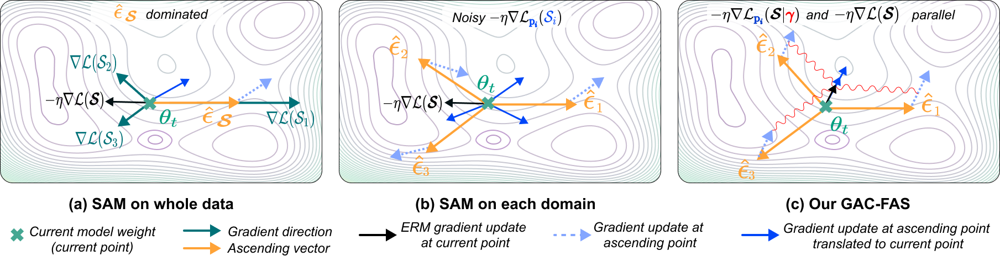
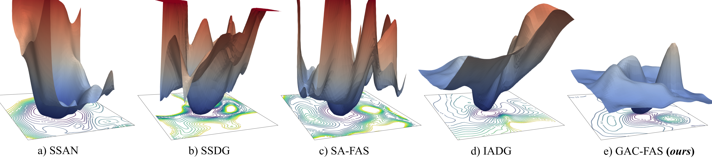

# Gradient Alignment for Cross-Domain Face Anti-Spoofing

*The IEEE/CVF Conference on Computer Vision and Pattern Recognition 2024* <br /> 


## Overview

<p align="center">
    
<p>

## 1. Installation
- Ubuntu 18.04.5 LTS
- CUDA 11.3
- Python 3.6.12
- pytorch == 1.10.1
## 2. Dataset

- Idiap Replay Attack [[paper](https://ieeexplore.ieee.org/document/6313548)]
- OULU-NPU [[paper](http://ieeexplore.ieee.org/document/7961798)]
- CASIA-MFSD [[paper](https://ieeexplore.ieee.org/document/6199754)]
- MSU-MFSD [[paper](http://biometrics.cse.msu.edu/Publications/Face/WenHanJain_FaceSpoofDetection_TIFS15.pdf)]

#### Data pre-processing: Follow the preprocessing steps in [SAFAS](https://github.com/sunyiyou/SAFAS).

## 3. Training
Our implementaion of GAC-FAS is in `optimizers/gacfas.py`

Start training: 
```python train.py --config ./configs/ICM2O.yaml```

| Methods | **ICM2O** |  | **OCM2I** |  | **OCI2M** |  | OMI2C |  |
| :---: | :---: | :---: | :---: | :---: | :---: | :---: | :---: | :---: |
|  | HTER | AUC |  HTER | AUC | HTER | AUC | HTER | AUC |
| MMD-AAE   | 40.98 | 63.08 | 31.58 | 75.18 | 27.08 | 83.19 | 44.59 | 58.29 |
| MADDG   | 27.98 | 80.02 | 22.19 | 84.99 | 17.69 | 88.06 | 24.50 | 84.51 |
| RFM   | 16.45 | 91.16 | 17.30 | 90.48 | 13.89 | 93.98 | 20.27 | 88.16 |
| SSDG-M   | 25.17 | 81.83 | 18.21 | 94.61 | 16.67 | 90.47 | 23.11 | 85.45 |
| SSDG-R   | 15.61 | 91.54 | 11.71 | 96.59 | 7.38 | 97.17 | 10.44 | 95.94 |
| D2AM | 15.27 | 90.87 | 15.43 | 91.22 | 12.70 | 95.66 | 20.98 | 85.58 |
| SDA   | 23.10 | 84.30 | 15.60 | 90.10 | 15.40 | 91.80 | 24.50 | 84.40 |
| DRDG  | 15.63 | 91.75 | 15.56 | 91.79 | 12.43 | 95.81 | 19.05 | 88.79 |
| ANRL  | 15.67 | 91.90 | 16.03 | 91.04 | 10.83 | 96.75 | 17.85 | 89.26 |
| SSAN   | 13.72 | 93.63 | 8.88 | 96.79 | 6.67 | 98.75 | 10.00 | 96.67 |
| AMEL   | 11.31 | 93.96 | 18.60 | 88.79 | 10.23 | 96.62 | 11.88 | 94.39 |
| EBDG   | 15.66 | 92.02 | 18.69 | 92.28 | 9.56 | 97.17 | 18.34 | 90.01 |
| PathNet   | 11.82 | 95.07 | 13.40 | 95.67 | 7.10 | 98.46 | 11.33 | 94.58 |
| IADG   | 8.86 | 97.14 | 10.62 | 94.50 | 5.41 | 98.19 | 8.70 | 96.40 |
| SA-FAS   | 10.00 | 96.23 | 6.58 | 97.54 | 5.95 | 96.55 | 8.78 | 95.37 |
| UDG-FAS  | 10.97 | 95.36 | 5.86 | 98.62 | 5.95 | **98.47** | 9.82 |**96.76** |
| GAC-FAS (**ours**) | **8.60** (0.28) | **97.16** (0.40) | **4.29** (0.83) | **98.87** (0.60) | **5.00** (0.00) | 97.56 (0.06) | **8.20** (0.43) | 95.16 (0.09) |

## 4. Landscape visualization 

[[paper](https://proceedings.neurips.cc/paper/7875-visualizing-the-loss-landscape-of-neural-nets.pdf)][[code](https://github.com/tomgoldstein/loss-landscape)][[software](http://paraview.org/)]

<p align="center">
    
<p>
